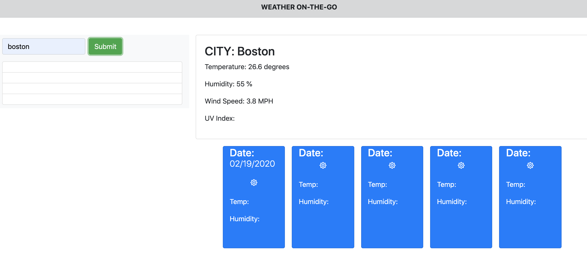

# About Weather-on-the-go
This is a weather dashboard that show you the current weather of a city. It also includes the 5-day forecast and a saved history of other cities that you've looked into. The dashboard shows the temperature, humidity, windspeed and UV Index. The UV index is hilighted in different colors to represent the safety/danger of the UV conditions.

## Layout of weather-on-the-go:

## Description

- Layout of the calendar using Bootstrap templates. There 3 three important parts on the dashboard: (1) the saved history of different cities we have searched for weather. (2) The main weather display of a current city with temperature, humidity, windspeed and UV Index. The UV index is hilighted in different colors to represent the safety/danger of the UV conditions.
- Getting information from the API for weather conditions, UV Index and the icons to represent different weather condition.
- Two URLs are utilized for this dashboard: one URL for the daily forecast, and the other for 5-day forecast.

## Link to weather-on-the-go: 

https://github.com/iamha1/weather-on-the-go

## Reference: 
- Bootstrap: https://getbootstrap.com/
- Moment Js: https://momentjs.com/
- Stackoverflow: https://stackoverflow.com/
- W3 School: https://www.w3schools.com/default.asp
- Font Aweseme: https://fontawesome.com/start
- Open weather APIs: https://openweathermap.org/api

